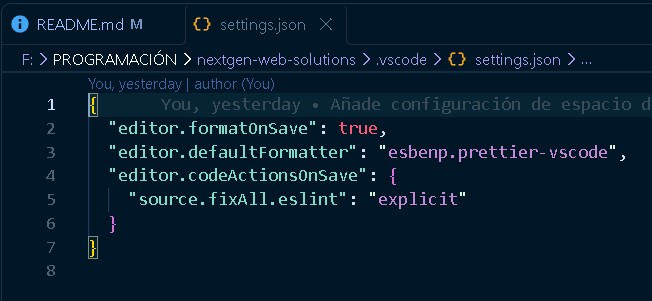
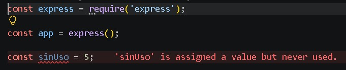
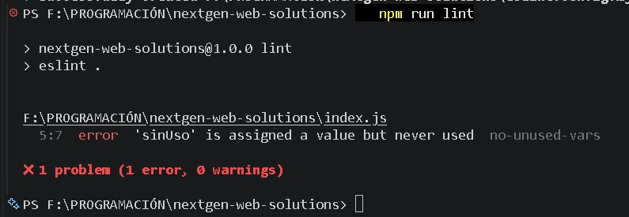
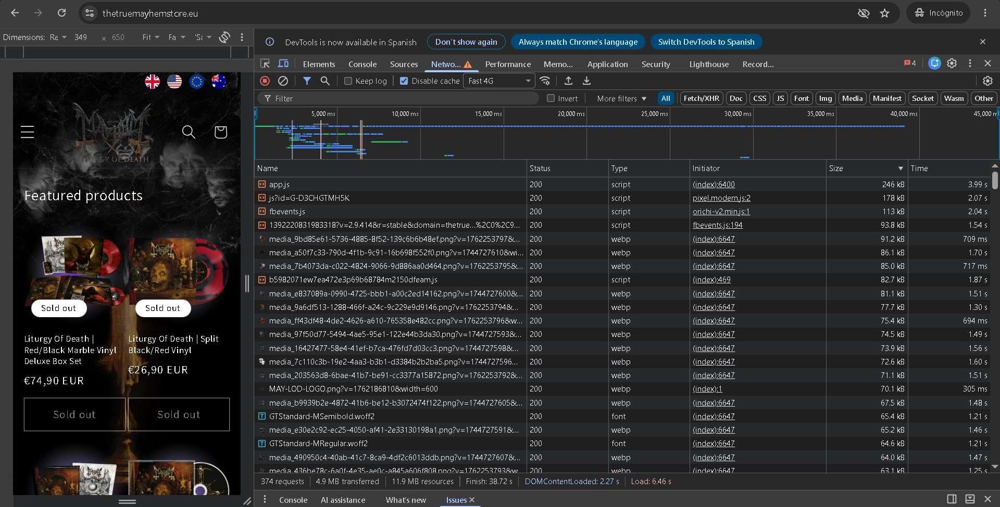
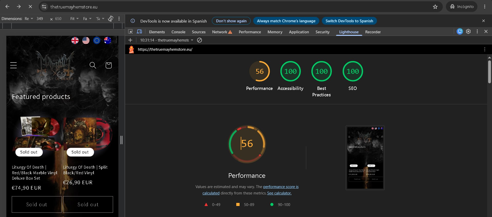
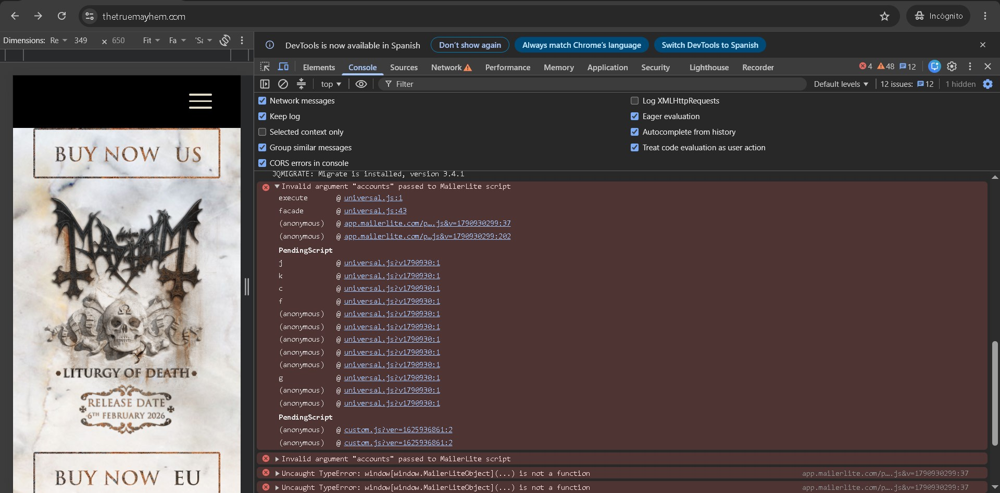
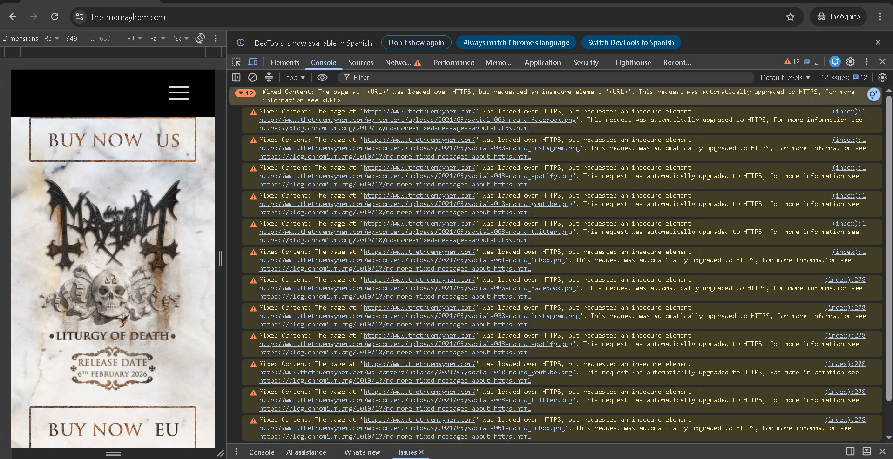
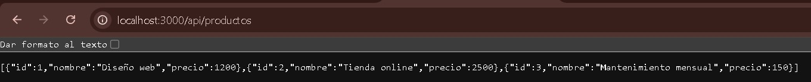

# NextGen Web Solutions: entorno profesional, auditoría con DevTools y microservicio

## Introducción

Como desarrollador junior de NextGen, el encargo consiste en analizar una tienda online con problemas de rendimiento y errores silenciosos y proponer mejoras. Para la auditoría se ha elegido un caso real: la web de The True Mayhem (`thetruemayhem.com`) y su tienda online (`thetruemayhemstore.eu`).

El trabajo se divide en tres tareas: preparar un entorno profesional en VS Code, auditar la web con las herramientas de desarrollo del navegador y crear un pequeño microservicio con npm y Git.

El repositorio reúne la configuración de VS Code, ESLint y Prettier, las capturas de la auditoría, el código del microservicio y este informe. La estructura principal es la siguiente:

```text
nextgen-web-solutions/
├── .vscode/
│   ├── extensions.json   ← extensiones recomendadas
│   └── settings.json     ← ajustes comunes del proyecto
├── capturas/             ← imágenes del informe
├── index.js              ← el microservicio
├── eslint.config.mjs
├── .prettierrc
├── .gitignore
├── package.json
├── package-lock.json
└── README.md
```

## 1. Entorno profesional en VS Code

### 1.1. Herramientas de desarrollo

#### ESLint

ESLint es un *linter*: analiza el código sin ejecutarlo y avisa de errores y malas prácticas, como variables que se declaran pero no se usan. Permite detectar estos problemas mientras se escribe. En este proyecto, las reglas están definidas en `eslint.config.mjs` a partir de la configuración recomendada.


#### Prettier

Prettier es un formateador de código. Se ocupa del aspecto del código, no de comprobar si funciona. Define cuestiones como las comillas, los puntos y coma, la sangría y la longitud de las líneas. En este proyecto, las reglas están en `.prettierrc`.

ESLint comprueba que el código sea correcto; Prettier se encarga de que el formato sea uniforme.


#### Error Lens

Error Lens muestra sobre la propia línea de código los avisos y errores que ya han detectado ESLint y VS Code. Así se pueden ver los problemas sin abrir el panel de Problemas. Su utilidad principal es hacerlos visibles mientras se trabaja.


#### GitLens

GitLens amplía las funciones de Git que ya ofrece VS Code. Permite ver quién modificó una línea, cuándo lo hizo y en qué commit mediante la función *blame*. También permite consultar el historial de los archivos desde el propio editor.


### 1.2. Configuración del entorno

El entorno de desarrollo tiene dos niveles de configuración. Uno es personal y recoge las preferencias de cada desarrollador. El otro pertenece al proyecto, se guarda en el repositorio y se comparte mediante Git. Si un ajuste aparece en los dos niveles, prevalece el del proyecto, por lo que las reglas comunes se mantienen aunque cada desarrollador tenga preferencias distintas.

#### Configuración del proyecto

La configuración compartida está en la carpeta `.vscode` y en los archivos de configuración del proyecto. Así, todos los desarrolladores trabajan con las mismas herramientas y reglas.

El archivo `.vscode/extensions.json` contiene las extensiones recomendadas para trabajar con el proyecto:

```json
{
  "recommendations": [
    "dbaeumer.vscode-eslint",
    "esbenp.prettier-vscode",
    "usernamehw.errorlens",
    "eamodio.gitlens"
  ]
}
```

Cuando otro desarrollador abre el proyecto, VS Code le muestra estas extensiones como recomendadas y puede instalarlas desde ahí.


El archivo `.vscode/settings.json` contiene tres ajustes específicos para este proyecto:

```json
{
  "editor.formatOnSave": true,
  "editor.defaultFormatter": "esbenp.prettier-vscode",
  "editor.codeActionsOnSave": {
    "source.fixAll.eslint": "explicit"
  }
}
```

`editor.formatOnSave` aplica el formateo al guardar, `editor.defaultFormatter` establece Prettier como formateador y `editor.codeActionsOnSave` ejecuta las correcciones de ESLint al guardar manualmente con `Ctrl + S`. Con `"explicit"`, ESLint no se ejecuta en los guardados automáticos.



Además, `.prettierrc` define las reglas de Prettier y `eslint.config.mjs` las reglas que usa ESLint para analizar el código. Como forman parte del repositorio, estas reglas son comunes para todo el equipo.

#### Configuración personal

No todas las preferencias deben formar parte del repositorio. El guardado automático al cambiar de archivo o de ventana es un ejemplo de una preferencia personal:

```json
{
  "files.autoSave": "onFocusChange"
}
```

Esta opción guarda los archivos cuando el editor pierde el foco, por ejemplo, al cambiar a otro archivo o a otra ventana. Se mantiene en la configuración personal porque es una preferencia de trabajo y no una regla del proyecto.

### 1.3. Flujo de trabajo

Las herramientas anteriores forman un flujo de trabajo que acompaña al código desde que se escribe hasta que se registra en el repositorio:

1. **Escritura.** Mientras se escribe, ESLint analiza el código y Error Lens muestra los avisos en la misma línea donde se producen, de modo que los problemas se corrigen en el momento.
2. **Guardado.** Al guardar con `Ctrl + S`, ESLint corrige automáticamente lo que puede y Prettier da formato al archivo. En el guardado automático, al cambiar de archivo o de ventana, solo actúa Prettier.
3. **Comprobación desde el terminal.** Los scripts `npm run lint` y `npm run format` aplican las mismas reglas sin depender del editor, por lo que el estándar se puede verificar en cualquier equipo.
4. **Registro del cambio.** Tras el commit, GitLens muestra en cada línea quién la modificó, cuándo y en qué commit, lo que permite seguir la evolución del código sin salir del editor. En la captura de `.vscode/settings.json` del apartado anterior se ve esta información encima de la primera línea.

Para comprobar el flujo, se declaró en `index.js` una variable sin usar. Error Lens la marcó en el editor y `npm run lint` detectó el mismo error en el terminal, con la regla `no-unused-vars`. Después se eliminó la variable y el lint volvió a salir limpio.




Así, el estándar de trabajo queda definido en el proyecto y no depende de los hábitos de cada desarrollador.

## 2. Auditoría con DevTools: Network

### 2.1. Objeto de estudio y metodología

La auditoría se ha realizado sobre la tienda `thetruemayhemstore.eu`, construida con Shopify, y sobre la web principal `thetruemayhem.com`, construida con WordPress. Se han usado las herramientas de desarrollo de Chrome (`F12`): **Network** para revisar los recursos descargados, **Console** para detectar errores y **Lighthouse** para medir el rendimiento.

En Network se activó *Disable cache* y se limitó la red a *Fast 4G*, para simular la primera visita de un usuario desde el móvil. Las pruebas de Lighthouse se han ejecutado en modo móvil, emulando un Moto G Power con una conexión *Slow 4G*.

### 2.2. Visión general de la carga

Al cargar la página principal de la tienda, Network registra **374 peticiones**, una transferencia de **4,9 MB** (11,9 MB de recursos sin comprimir) y un tiempo de carga (*Load*) de **6,46 s**. Es una cifra alta para una página de inicio. En una conexión móvil lenta, tantas peticiones y tantos datos aumentan el tiempo de carga.



### 2.3. Recursos que retrasan la carga

| Recurso | Peso | Problema |
|---|---|---|
| `app.js` | 246 kB | Script principal de gran tamaño que el navegador debe descargar y ejecutar antes de que la página responda |
| Scripts de terceros (Facebook Pixel, Google Analytics) | ~385 kB | Código de rastreo y publicidad que no aporta nada a la experiencia de compra |
| Imágenes de producto | 63–91 kB cada una | Se descargan todas al inicio, aunque no estén visibles en pantalla |
| Logo | 70,1 kB | Imagen mucho más grande de lo que se muestra en pantalla |

**Scripts de terceros.** El píxel de Facebook lo añade una aplicación de Shopify llamada Orichi. En la columna *Initiator* de Network se puede comprobar que `fbevents.js` (113 kB) lo carga `orichi-v2.min.js`, y que a su vez descarga la configuración del píxel (93,8 kB). A ellos se suma el script de Google (178 kB). Las aplicaciones de Shopify pueden añadir sus propios scripts, por lo que conviene revisar qué recursos incorpora cada una. También habría que comprobar si el píxel se está cargando dos veces: una desde la aplicación y otra desde la configuración de Shopify.

**Imágenes sin carga diferida.** Las imágenes de producto se descargan aunque todavía no sean visibles. Con `loading="lazy"`, el navegador puede esperar a que el usuario se acerque a ellas antes de descargarlas.

**Logo sobredimensionado.** El logo (`MAY-LOD-LOGO.png?width=600`) se pide con 600 píxeles de ancho, aunque en la cabecera del móvil ocupa mucho menos. Eso hace que se descarguen datos que no son necesarios.

### 2.4. Medición con Lighthouse

La puntuación de rendimiento de la tienda estuvo **entre 29 y 56 sobre 100** en distintas ejecuciones del mismo día, sin cambios en la web. Lighthouse puede dar resultados diferentes según las condiciones de la prueba, especialmente por la red y por la carga de los scripts de terceros. Las métricas siguientes corresponden a la ejecución con puntuación 29:

| Métrica | Valor | Qué mide |
|---|---|---|
| FCP (First Contentful Paint) | 3,4 s | Cuándo aparece el primer contenido en pantalla |
| LCP (Largest Contentful Paint) | 17,6 s | Cuándo se muestra el elemento principal de la página |
| TBT (Total Blocking Time) | 3240 ms | Tiempo en que la página no responde porque el navegador está ejecutando JavaScript |
| CLS (Cumulative Layout Shift) | 0 | Cuánto se mueven los elementos mientras se carga la página |
| Speed Index | 15,5 s | Rapidez con la que se completa visualmente la página |

Los peores datos son el LCP y el TBT. El TBT mide el tiempo en que JavaScript bloquea la página, por lo que es la consecuencia medible de `app.js` y de los scripts de terceros vistos en Network. El CLS de 0 es el único dato positivo: la página no se desplaza mientras carga. La tira de imágenes de la captura muestra seis fotogramas en blanco antes de que aparezca el contenido, lo que explica el Speed Index de 15,5 s.

Las otras tres categorías de Lighthouse (accesibilidad, buenas prácticas y SEO) obtuvieron 100. El principal problema detectado está, por tanto, en el rendimiento.




### 2.5. Recomendaciones de rendimiento

1. Revisar las aplicaciones de Shopify instaladas y eliminar las que no se usen, empezando por las que añaden scripts de rastreo.
2. Comprobar si el píxel de Facebook se carga por duplicado y dejar una sola integración.
3. Aplicar carga diferida (`loading="lazy"`) a las imágenes que no son visibles al cargar la página.
4. Redimensionar el logo al tamaño con el que se muestra y servirlo en un formato moderno como WebP.
5. Revisar el contenido de `app.js` para dividirlo o retrasar la carga de las partes que no hacen falta al inicio.

## 3. Auditoría con DevTools: Console

El encargo habla de "errores silenciosos": fallos que no rompen nada visible, pero que indican que algo no funciona bien. En la web principal de The True Mayhem se han encontrado dos tipos.

### 3.1. Errores de script de MailerLite

MailerLite es el servicio de *email marketing* que gestiona la suscripción a la newsletter del grupo. En la consola aparecen dos errores relacionados y cada uno se repite dos veces:

```text
Invalid argument "accounts" passed to MailerLite script
Uncaught TypeError: window[window.MailerLiteObject](...) is not a function
```

Los errores no aparecían en todas las recargas. Por eso fue necesario activar **Keep log** en la consola para conservar los mensajes entre cargas.


**Origen de los errores.** Al buscar `mailerlite` en Network se localizó `a3e6l8q7n6_popups.js` (en adelante, `popups.js`), servido desde `static.mailerlite.com`. Sus líneas 35 a 37 permiten entender los dos errores:

```js
window.MailerLiteObject = window.MailerLiteObject || 'ml';
window[window.MailerLiteObject] = window[window.MailerLiteObject] || function () {};
… account = window[window.MailerLiteObject]('accounts')('723…
```

La línea 37 aparece recortada por el buscador de DevTools, pero se aprecia la doble llamada.

1. La línea 35 establece que la función de MailerLite se llamará `ml`.
2. La línea 36 crea `ml` como función vacía si todavía no existe.
3. La línea 37 hace dos llamadas encadenadas: primero `ml('accounts')` y después una segunda llamada usando el resultado.

La versión actual de MailerLite no reconoce el argumento `'accounts'` y produce el **primer error**. Como la llamada devuelve `undefined`, la línea 37 intenta ejecutar ese resultado como si fuera una función y produce el **segundo error**. Por tanto, **el primer error provoca el segundo**.


La traza del primer error, desplegada en la consola, confirma este recorrido. Leída de abajo arriba, la llamada parte de `custom.js?ver=1625936861`, pasa por `universal.js` y llega a la línea 37 del script de MailerLite.



**Diagnóstico.** En la página aparecen dos integraciones de MailerLite de épocas distintas: `popups.js`, del sistema antiguo de ventanas emergentes, y `universal.js`, el script actual, que ya no acepta la llamada `accounts`. Además, `custom.js?ver=1625936861` tiene una versión de julio de 2021. Todo apunta a una web montada en 2021 y actualizada solo en parte: se añadió el script nuevo sin retirar el antiguo.

**Por qué los errores son intermitentes.** La explicación más probable es que los scripts se cargan de forma asíncrona y el orden puede cambiar según la velocidad de la red. Si uno llega antes que otro, se produce el fallo. Esto encaja con que los errores aparecieran con Lighthouse, que simula una red lenta, y en algunas primeras visitas, pero no siempre al recargar.

**Una pista falsa.** Buscar `mailerlite` en Network devuelve **782 coincidencias en 154 archivos**. Como se ve en la captura de `popups.js`, la mayoría corresponden a una cookie de MailerLite (`mailerlite:webform:shown`) que el navegador envía en cada petición al dominio, no a cientos de scripts. Por eso hay que distinguir esas coincidencias del código que realmente provoca el error.

### 3.2. Contenido mixto (Mixed Content)

La consola muestra **12 avisos de Mixed Content**. Aparecen cuando una página cargada por HTTPS intenta cargar recursos mediante HTTP. En este caso son seis iconos de redes sociales (Facebook, Instagram, Spotify, YouTube, Twitter y correo), cargados dos veces cada uno, cuyas direcciones siguen apuntando a `http://` en la carpeta de subidas de WordPress de mayo de 2021.

Chrome los ha actualizado automáticamente a HTTPS, por lo que ahora se muestran. Sin embargo, la página depende de que el navegador corrija esas direcciones y no queda limpia en una revisión de seguridad.



### 3.3. Recomendaciones

1. Eliminar la integración antigua de MailerLite (`popups.js` y la llamada desde `custom.js`) y mantener solo el código de inserción actual.
2. Actualizar las direcciones de las imágenes de `http://` a `https://` en la base de datos de WordPress.
3. Incorporar una herramienta de registro de errores en producción, ya que los fallos intermitentes como estos son difíciles de detectar revisando la consola a mano.

## 4. Microservicio con npm y Git

### 4.1. Inicialización y dependencias

El proyecto se ha creado con `npm init -y`, que genera `package.json`, donde se define la información y las dependencias del proyecto. Las dependencias se dividen en dos grupos:

| Tipo | Paquete | Uso |
|---|---|---|
| `dependencies` | `express` | Framework con el que se crea el servidor; el programa lo necesita para funcionar |
| `devDependencies` | `eslint`, `@eslint/js`, `globals` | Análisis del código y configuración de ESLint para Node |
| `devDependencies` | `prettier` | Formateo del código |

Las dependencias de desarrollo se utilizan durante el desarrollo y no son necesarias para ejecutar el programa en producción.


### 4.2. Scripts de npm

```json
"scripts": {
  "test": "echo \"Error: no test specified\" && exit 1",
  "start": "node index.js",
  "lint": "eslint .",
  "format": "prettier --write ."
}
```

- `npm start` ejecuta `node index.js`, que arranca el servidor.
- `npm run lint` ejecuta `eslint .`, que analiza todo el proyecto (el punto indica la carpeta actual).
- `npm run format` ejecuta `prettier --write .`, que formatea todo el proyecto y guarda los cambios en los archivos.
- `npm test` es el script que crea npm por defecto; el proyecto todavía no incluye pruebas.

### 4.3. Rutas del microservicio

El microservicio está definido en `index.js`. El puerto (3000) está definido como una constante al principio del archivo, de modo que se puede cambiar desde un único punto. Expone dos rutas que devuelven datos en formato JSON.

**`/api/servicios`** devuelve la lista de servicios de la agencia.


**`/api/productos`** devuelve un catálogo de productos con su identificador, nombre y precio: diseño web, tienda online y mantenimiento mensual.



### 4.4. Cómo ejecutarlo

```powershell
git clone https://github.com/CarlosPaskual/nextgen-web-solutions.git
cd nextgen-web-solutions
npm install
npm start
```

Después, abre en el navegador `http://localhost:3000/api/servicios` o `http://localhost:3000/api/productos`.

### 4.5. Control de versiones con Git

El archivo `.gitignore` excluye la carpeta `node_modules`, donde se guardan las dependencias instaladas. No se sube al repositorio porque se puede volver a generar con `npm install` a partir de `package.json` y `package-lock.json`.

Cada paso del proyecto se ha guardado en un commit con un mensaje descriptivo. Así, el historial permite seguir la evolución del trabajo:

```text
90ba485 Revisión capturas y Readme
31ac811 Añade configuración de espacio de trabajo y extensiones recomendadas
2539e04 Añade capturas de la auditoría con DevTools
5ea0b2d Ruta /api/servicis, nuevas capturas
a7f2ba2 Ruta /api/servicios, puerto como constante y datos del paquete
331064d Configura ESLint y Prettier, scripts de npm y primera ruta del microservicio
b829ef4 Inicializa el proyecto con npm: Express, ESLint y Prettier
```

## 5. Mentalidad de desarrollador

Este trabajo ha permitido comprobar en la práctica que algunas ideas habituales sobre el desarrollo web no siempre son ciertas.

**"VS Code es un IDE."** Un IDE (entorno de desarrollo integrado) reúne en una sola herramienta funciones como el análisis del código, la depuración, el terminal y el control de versiones. VS Code recién instalado no tenía avisos de ESLint, ni el formateo de Prettier, ni la información de historial que aporta GitLens. En este proyecto, esas funciones se han añadido mediante extensiones y configuración. Por tanto, VS Code no es un IDE por sí mismo: es un editor de código que se convierte en uno cuando se configura.

**"Si la web se ve bien, no tiene errores."** La web de The True Mayhem funciona aparentemente con normalidad, pero la consola muestra errores de MailerLite que solo aparecen en algunas cargas. Un error silencioso puede afectar a una función, como la suscripción a la newsletter, sin que el usuario lo vea.

**"La nota de Lighthouse es un dato fijo."** La misma tienda obtuvo 56 a las 10:31 y 29 a las 10:47 del mismo día, sin cambios en la web. Por eso conviene repetir las mediciones y mirar las métricas, no quedarse con una sola puntuación.

**"`node_modules` se sube al repositorio."** Las dependencias no se suben: se indican en `package.json` y se instalan con `npm install`. Por eso `node_modules` aparece en `.gitignore`.

**"El formato del código es cosa de cada uno."** Con `.prettierrc` y la carpeta `.vscode` en el repositorio, el equipo puede usar el mismo formato aunque cada desarrollador tenga sus propias preferencias.

## 6. Conclusión

El trabajo incluye las tres tareas del encargo. La configuración de VS Code está en el repositorio, junto con las reglas de ESLint y Prettier, para mantener el mismo formato y estilo en el proyecto.

La auditoría ha encontrado demasiadas peticiones y scripts de terceros en la tienda. También se ha detectado una integración antigua de MailerLite que provoca errores silenciosos en la web principal.

El microservicio está preparado con npm y Git, incluyendo sus dependencias, scripts e historial de cambios.

Las mejoras más importantes son reducir los scripts de terceros de la tienda y eliminar la integración antigua de MailerLite. Estos dos cambios pueden mejorar el rendimiento de la web y evitar errores que el usuario no llega a ver.

